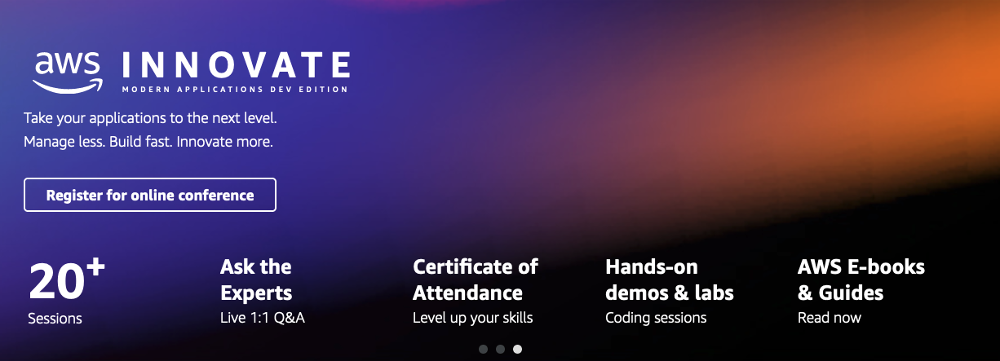

  

The following labs will give you hands-on experience with a number of the topics discussed during the AWS Innovate Modern Applications Edition.

ℹ️ **You will run these lab in your own AWS account. Please follow directions at the end of the labs to remove resources to minimize costs.**

These labs will remain available after AWS Innovate Modern Applications Edition. **You can do them at any time**, even after AWS Innovate Modern Applications Edition.

## [Modern Serverless Web App](https://github.com/roshansthomas/voterocket-lab)

In this lab, learn how to build the Vote Rocket voting web application with React and the AWS Amplify Framework. 

Duration: 90 minutes

[View lab instructions](https://github.com/roshansthomas/voterocket-lab)

---

## [Deploy Locust Cluster By AWS CDK](https://github.com/roshansthomas/python-cdk-locust)

This lab walks you through creating a CDK project in Python that will implement an Amazon ECS Service running Locust.io.

Duration: Approximately 45 - 60 minutes

[View lab instructions](https://github.com/roshansthomas/python-cdk-locust)

----

## [Building CI/CD workflows for serverless applications](https://github.com/roshansthomas/cicdworkflowserverless)

In this lab, we cover the basic of building a pipeline for your serverless applications as well as how you can use serverless in your pipelines.
Discover how with serverless applications, building your CI and CD workflows becomes even easier and faster to get up and running with a code to production flow.

Duration: Approximately 60 minutes

[View lab instructions](https://github.com/roshansthomas/cicdworkflowserverless)

---

## [Containerized Web App on AWS App Runner](https://github.com/phonghuule/aws-app-runner)

AWS App Runner is a new service that provides customers with a fast, simple, and secure way to deploy applications on AWS without managing any infrastructure. In this lab, learn how to build and run a containerized application in AWS App Runner.

Duration: Approximately 45 minutes

[View lab instructions](https://github.com/phonghuule/aws-app-runner)

---

## [The 2048 Game On Amazon EKS](https://github.com/phonghuule/eks-2048-game)

In this lab, we walk through the steps of setting up Application Load Balancer (ALB) Ingress controller, deploying sample application (game 2048) and exposing the application publicly via ALB.

Duration: Approximately 60 minutes

[View lab instructions](https://github.com/phonghuule/eks-2048-game)

---

## [Amazon EKS on AWS Fargate](https://github.com/phonghuule/eks-fargate)

In this lab, we demonstrate how to run Elastic Kubernetes Service on AWS Fargate.

Duration: Approximately 60 minutes

[View lab instructions](https://github.com/phonghuule/eks-fargate)

---

## [Event-driven microservices with AWS](https://github.com/donnieprakoso/workshop-eventDrivenMicroservices)

In this lab, learn how to build and deploy a series of simple microservices with an event-driven architecture approach.
The main objective of this lab is to build a foundation of extending and scaling microservices architecture by leveraging synchronous and asynchronous communication — with choreography and orchestration patterns.

Duration: Approximately 60 minutes

[View lab instructions](https://github.com/donnieprakoso/workshop-eventDrivenMicroservices)

---

## [Chaos engineering on AWS](https://chaos-engineering.workshop.aws/en/010_introduction.html)

This lab provides an introduction to chaos engineering using Amazon Web Services (AWS) tooling, with a focus on AWS Fault Injection Simulator (FIS). Learn how to use FIS and other AWS tools to inject faults in your infrastructure to validate your system’s resilience as well as verifying your alarms, observability, and monitoring practices.\

Duration: Approximately 60 minutes

[View lab instructions](https://chaos-engineering.workshop.aws/en/010_introduction.html)

---

## [Microsoft DevOps on AWS Lab](https://msdevops.workshop.aws/000introduction.html)

In this lab, learn more about how you can integrate their Azure DevOps tools with AWS. The goal of this technical training is to make you comfortable with some of the AWS software & infrastructure deployment mechanisms and show you the avenues to integrate your CI/CD systems with AWS.

[View lab instructions](https://msdevops.workshop.aws/000introduction.html)

